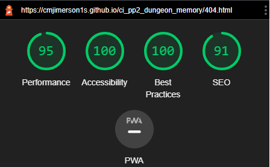

# Dungeon Memory
(Developer: Christopher Jimerson)

[Live Site](https://cmjimerson1s.github.io/ci_pp2_dungeon_memory/) 

## Table of Contents

1. [Project Goals](#project-goals)
    1. [User Goals](#user-goals)
    2. [Site Owner Goals](#site-owner-goals)
2. [User Experience](#user-experience)
    1. [Target Audience](#target-audience)
    2. [User Requrements and Expectations](#user-requrements-and-expectations)
    3. [User Stories](#user-stories)
3. [Design](#design)
    1. [Design Choices](#design-choices)
    2. [Colour](#colour)
    3. [Fonts](#fonts)
    4. [Structure](#structure)
    5. [Wireframes](#wireframes)
4. [Technologies Used](#technologies-used)
    1. [Languages](#languages)
    2. [Frameworks And Tools](#frameworks-and-tools)
5. [Features](#features)
6. [Testing](#validation)
    1. [HTML Validation](#HTML-validation)
    2. [CSS Validation](#CSS-validation)
    3. [Accessibility Validation](#accessibility-validation)
    4. [Javascript Validation](#javascript-validation)
    5. [Performance](#performance)
    6. [Device testing](#performing-tests-on-various-devices)
    7. [Browser compatibility](#browser-compatability)
    8. [Testing user stories](#testing-user-stories)
8. [Bugs](#Bugs)
9. [Deployment](#deployment)
10. [Credits](#credits)
11. [Acknowledgements](#acknowledgements)

## Project Goals 

The goal of this development project was to develop a website that has two intuitive and interactive games, meant to be able to be replayed multiple times. 

### User Goals
-Enjoy an intuitive and easy gameplay
 
-Test memory capabilities and see improvement by evaluating own scores
 
-Challenge knowledge of pop culture fantasy trivia
 

### Site Owner Goals

-Collect user data and feedback
 
-Develop a game that can be expanded
 
-Create a game that has intuitive interactivity
 
-Design the games to be responsive regardless of device
 
-Notify the user when they have failed, or succeeded, at the game tasks

## User Experience

### Target Audience

-Users who are fans of the fantasy genre
 
-Users who are looking for challenging games
 
-Enthusiasts of puzzle or memory based games
 

### User Requirements  and Expectations

-Know what page I’m currently visiting
 
-Simple ease of use in the game functionality 
 
-Visibility of how to contact company or find their social media
 
-Have a new experience in the memory game every visit to the site

### User Stories

1. As Sam, I want a game that is different every time I play so I can keep returning and enjoying the sites content.
2. As Oskar, I want a game that is interactive and responds to me so I can easily understand what input I'm providing.	
3. As Lucie, I want a game that lets me know how well I'm doing so I can compare my current success to my other attempts.
4. As Daniel, I want to be notified when I've made a mistake so I can try to do better my next play though.
5. As Natali, I want a way to communicate with the site owner so I can relay my opinion about the product.	
6. As Alex, I want to know if my communication was successful so I don't have to try and blindly to reach the site owner again and again. 
7. As Sarah, I want a game that can teach me something so I can feel accomplished when I'm finished playing.    
8. As Tim, I want to know where I can reach you on social media so I can share the site with friends and family.
9. As Moa, I want to easily be able to restart my game experience when done.	
10. As the site owner, I want the user to be able to navigate easily so they can easily consume the sites content.
11. As the site owner, I want the user t be able to easily return to the site if they visit a non-existing/non-working page on the site. 	

## Design

### Design Choices
The design is meant to be simple and easy to visually understand, while also evoking the aesthetic of 8-bit video games, as they are a historical part of the pop-culture and fantasy genre. The background is meant as a visualization of ‘dungeon diving’ which is a play on the site’s name and the cliche act found in many fantasy series. 

### Colour
The colours used are dark and cool, visually lending to the feel of being in the dark or subterranean spaces, hammering home the ‘dungeon’ theme of the background style, as well as accenting the dragon tokens used. 

### Fonts
The font used is pixelated and again is meant to evoke the video games of the past, being both nostalgic and modern. The Google Fonts family chosen was VT323.

### Structure
The structure of the website is simple, by design, and comprises three individual pages, one for each game and one for the contact form. The navigation is simple and intuitive, and with a simple underline highlights the page the user currently is one. 
 
-Game: The page where the memory game resides, also the main landing page of the site.
 
-Quiz: This page generates trivia quiz questions while displaying the number the user is on, and score.
<bn>
-Contact Us: This page is a simple form allowing the user to submit feedback on their experience. 

### Wireframes

Game

Quiz

Contact Us

## Technologies Used

### Languages
-HTML
 
-CSS
 
-Javascript

### Frameworks and Tools
-GitPod
 
-GitHub
 
-Font Awesome
 
-Google Fonts
 
-Google Maps
 
-Favicon
 
-Balsamiq
 
-EmailJS
 
-Favicon.io
 

## Features

### Current Features

### Logo and Nav
Helps the customers move through the pages in an intuitive manner
 
User stories covered: 10

### Memory Game
A simple 4 x 4 memory game that automatically randomizes the tile for every game that's played
 
User stories covered: 1

	
### Game Score Section
This helps users keep track of their score, transforming the text to the score after the user starts the game  
 
User stories covered: 3

		
### Quiz
A game that displays random fantasy trivia
 
User stories covered: 7

		
### Choice Highlight
When hovering over the trivia answer the user wishes to choose the button becomes larger indicating the choice about to be input
 
User stories covered: 2

		
### Wrong Answer
When a choice is made the quiz highlights red when the answer given is wrong, but returns to uncoloured for the next question
 
User stories covered: 4

### Right Answer
When a choice is made the quiz highlights green when the answer given is correct, but returns to uncoloured for the next question. 
 
User stories covered: 3

		
### Current Status of Quiz
This feature shows the user what number, out of ten, they are on for the trivia, and their current score.
 
User stories covered: 3

	
### Game Notification
This alert shows the user their final score and that the quiz is now done.
 
User stories covered: 6

		
### Contact Form
A form that allows users to contact the site owners providing their name, email, and a comment about the games.
 
User stories covered: 5

 
		
### Submit Button Status
The button for the form updates to show the status of the submission 
 
User stories covered: 6

### Play Again Button
This button at the end of the contact form takes players back to the memory game
 
User stories covered: 9

### 404 Page
The 404 page allows users to know if they have navigated to a non-working or non-existing page on the site, and allows them to return to the main site easily.
 
User stories covered: 11

### Footer
The footer holds links to all our social media platforms allowing for quick access to our business platforms there
 
User stories covered: 8

## Validation

### HTML Validation
Utilizing W3C HTML Validation, (link) all pages pass with no errors

Game

    

Quiz

    

Contact Us

    

404

    

    
### CSS Validation
Utilizing W3C Jigsaw CSS Validation, the whole CSS file passed without errors or warnings

Validation style.css

### Accessibility Validation
WAVE WebAIM was used to evaluate the accessibility of the website and every page passed with 0 errors and 0 contrast errors

Game

    

Quiz

    

Contact Us

    

404

    

### JavaScript Validation
JSHint was used to evaluate the JavaScript controlling the pages of the website, all passed with no significant errors

Game

    

Quiz

    

Contact Us

    

### Performance
Utilizing Google Lighthouse through the Google Chrome Developer toolset all pages were tested for performance, with every page succeeding in a rating of over 90 for every category.

Game

    

Quiz

    

Contact Us

    

404

    

### Performing tests on various devices 
The website was testing on the following devices

-Samsung S10
 
-Iphone 8
 
-Samsung S22
 
-Galaxy Tab
 
-Lenovo Legion 16.9 inch Laptop

The site was also tested using the many emulated devices through the use of Google Chrome Developer Tools

### Browser compatibility
The website was evaluated and tested on the following browsers below:

-Mozilla Firefox
 
-Chrome
 
-Microsoft Edge

### Testing user stories

1. 	As Sam, I want a game that is different every time I play so I can keep returning and enjoying the site's content.

| **Feature** | **Action** | **Expected Result** | **Actual Result** |
|-------------|------------|---------------------|-------------------|
|  Memory Game  | Load the Game page| Randomizes the tiles for each play  | Works as expected |

2. 	As Oskar, I want a game that is interactive and responds to me so I can easily understand what input I'm providing.

| **Feature** | **Action** | **Expected Result** | **Actual Result** |
|-------------|------------|---------------------|-------------------|
| Choice Highlight  | Hover over choices | Magnifies the current choice | Works as expected  |

Screenshots

3. As Lucie, I want a game that lets me know how well I'm doing so I can compare my current success to my other attempts.

| **Feature** | **Action** | **Expected Result** | **Actual Result** |
|-------------|------------|---------------------|-------------------|
| Game Score Section | Play game, and earn points | Display the amount of points earned | Works as expected |
| Right Answer | Chose the correct answer in the quiz | Highlights green, showing accuracy | Works as expected  |

Screenshots

4. 	As Daniel, I want to be notified when I've made a mistake so I can try to do better my next play though.

| **Feature** | **Action** | **Expected Result** | **Actual Result** |
|-------------|------------|---------------------|-------------------|
|  Wrong Answer | Choose the wrong answer in the quiz| Highlights red, showing inaccuracy | Works as expected |

Screenshots

5. As Natali, I want a way to communicate with the site owner so I can relay my opinion about the product.	

| **Feature** | **Action** | **Expected Result** | **Actual Result** |
|-------------|------------|---------------------|-------------------|
| Contact Form | Navigate to Contact Us Page | Display a working form to be filled out | Works as expected |

Screenshots

6. As Alex, I want to know if my communication was successful so I don't have to try and blindly reach the site owner again and again.

| **Feature** | **Action** | **Expected Result** | **Actual Result** |
|-------------|------------|---------------------|-------------------|
| Submit Button Status | Click submit button | Button displays the different status' of the forms delivery | Works as expected |

Screenshots

7. As Sarah, I want a game that can teach me something so I can feel accomplished when I'm finished playing

| **Feature** | **Action** | **Expected Result** | **Actual Result** |
|-------------|------------|---------------------|-------------------|
|  Quiz | Play the game on the Quiz page | Generate trivia questions with three choices to try and guess right | Works as expected |

Screenshots

8. As Tim, I want to know where I can reach you on social media so I can share the site with friends and family.	

| **Feature** | **Action** | **Expected Result** | **Actual Result** |
|-------------|------------|---------------------|-------------------|
| Footer | Scroll to bottom of any page | Display buttons that take users to the exterior social media link | Works as expected |

Screenshots

9. As Moa, I want to easily be able to restart my game experience when done.	

| **Feature** | **Action** | **Expected Result** | **Actual Result** |
|-------------|------------|---------------------|-------------------|
| Play Again  | Click the Play Again? button at the end of the contact form | Takes user back to the index.html page and to play the memory game again | Works as expected |

Screenshots

10. As the site owner, I want the user to be able to navigate easily so they can easily consume the site's content.

| **Feature** | **Action** | **Expected Result** | **Actual Result** |
|-------------|------------|---------------------|-------------------|
| Logo and Nav  | Scroll to the top of any page on the site | Display the links to the other pages of the site, while highlighting what page the user is currently on | Works as expected |

Screenshots

11. As the site owner, I want the user to be able to easily return to the site if they visit a non-existing/non-working page on the site.

| **Feature** | **Action** | **Expected Result** | **Actual Result** |
|-------------|------------|---------------------|-------------------|
|  404 Page | Visit a page that doesn't exist on the site | Display a warning, and a link to return to the main site | Works as expected  |

Screenshots

## Bugs

### JHint EMailJS Error
When I ran my JavaScript for the Contact Us page JHint threw up an error about the email.js being used, and after research I understand this is a common occurrence  with JHint, as EmailJS works perfectly fine, as is, with the code snippets  used. 

Screenshots

### JHint 'is only available in ES6 (use 'esversion: 6' or '8' etc)
My files are throwing up a warning that states certain syntax and code uses is only available in ES6 (use 'esversion: 6'), or 8, etc. I was unable to remove these messages but in my research I found that these are not errors in my code but something to do with how JHint validates. 

## Deployment

The website was deployed using GitHub Pages by following these steps:
1. In the GitHub repository navigate to the Settings tab
2. On the left hand menu select Pages
3. For the source select Branch: master
4. After the webpage refreshes automatically you will see a ribbon on the top saying: "Your site is published at https://cmjimerson1s.github.io/ci_pp2_dungeon_memory/"

You can for fork the repository by following these steps:
1. Go to the GitHub repository
2. Click on Fork button in upper right hand corner

You can clone the repository by following these steps:
1. Go to the GitHub repository 
2. Locate the Code button above the list of files and click it 
3. Select if you prefer to clone using HTTPS, SSH, or Github CLI and click the copy button to copy the URL to your clipboard
4. Open Git Bash
5. Change the current working directory to the one where you want the cloned directory
6. Type git clone and paste the URL from the clipboard ($ git clone https://github.com/YOUR-USERNAME/YOUR-REPOSITORY)
7. Press Enter to create your local clone.

## Credits
This video (https://www.youtube.com/watch?v=tjyDOHzKN0w) was the inspiration for my memory game
 
I used this video to understand the logic of the quiz game (https://www.youtube.com/watch?v=f4fB9Xg2JEY&t=2669s)

### Media
All of the weapon tokens were created from this file, on <a href="https://gameartpartners.com/downloads/100-pixel-art-weapon-icons-2/">GameArtPartners</a>
 
[dragon.png] (assets/img/dragon.png): Designed by user: <a href ="https://www.reddit.com/user/TheCraftingCow/">The crafting cow</a> on <a href="https://www.reddit.com/r/Minecraft/comments/k3gwat/i_drew_this_ender_dragon_pixel_art_what_should_i/">on Reddit</a>
 
[gold.png] (assets/img/gold.png): Designed by user: <a href="https://www.shutterstock.com/g/non157">non248 pixel art</a>, on <a href="https://www.shutterstock.com/image-vector/vector-pixel-art-gold-coin-isolated-1209030841">Shutter Stock</a>
 
[dungeon_bg.jpg] (assets/img/dungeon_bg.jpg): Designed by user <a href="https://www.shutterstock.com/g/YUCALORA">YUCALORA</a>, on <a href="https://www.shutterstock.com/image-vector/dungeon-long-medieval-castle-corridor-torches-2126199458">Shutter Stock</a>

### Code
Use of EmalJS snippets  located in file contact.js(assets/js/contact.js) can be found at emailjs.com.
Use of favicon.io snippets  located in files index.html, quiz.html, contact.html, and 404.html can be found at favicon.io.

## Acknowledgements
This has been an amazing experience, and I have many people to thank...
 
My mentor, Mo Shami, has been a great source of information and has helped me quite a bit. Truly above and beyond.
 
My husband, Leo, he's done so much to help me be able to devote the time to this project. You have been so supportive and I love you so much for all you do.
 
My housemate and very good friend, Trevor, who has really been amazing in helping around the house to let me have the time to do this project. You go above and beyond and I appreciate you so much for what you do.
 
Oskar, you have been an unending supportive friend, and I'm lucky to have you in my corner. 

